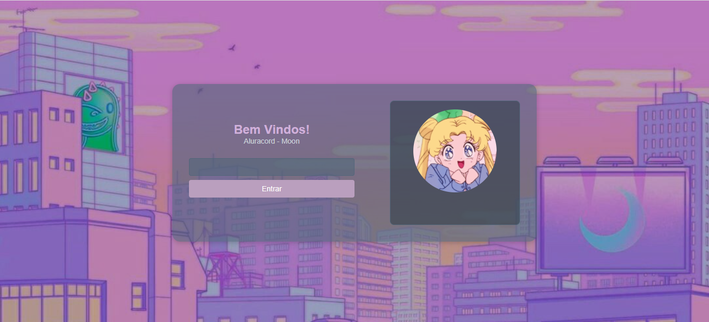
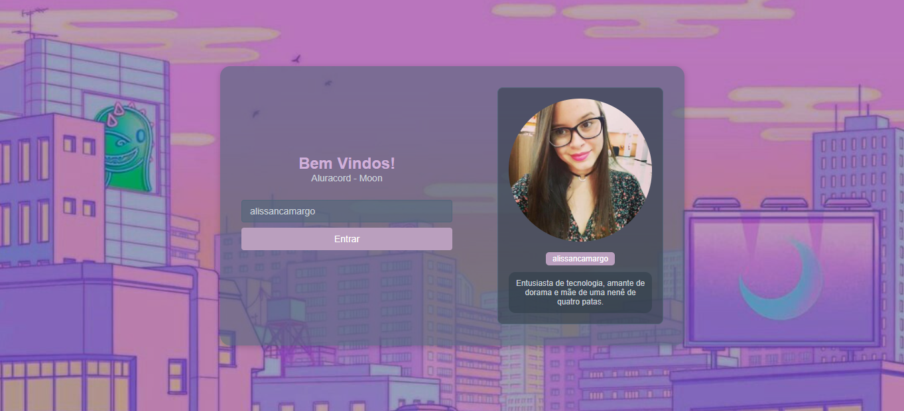
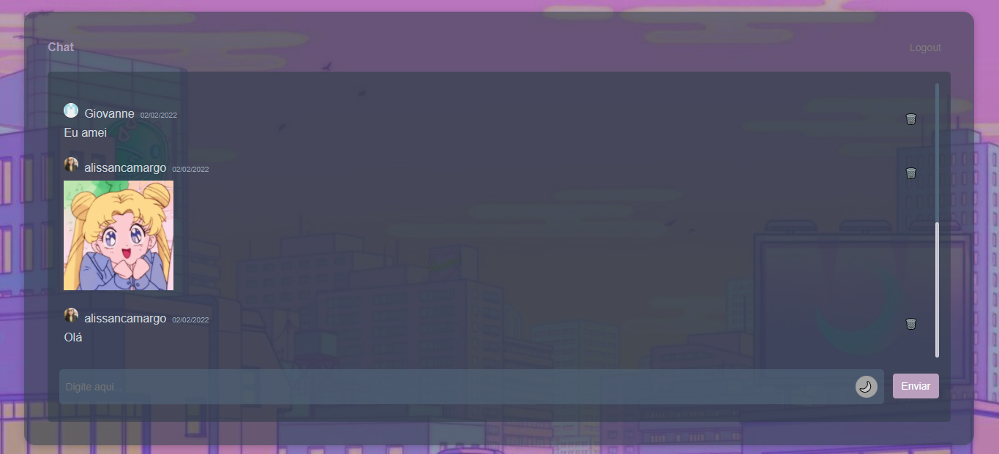
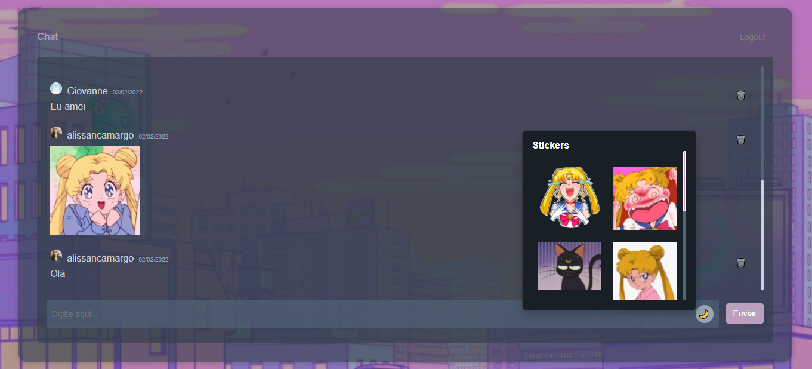
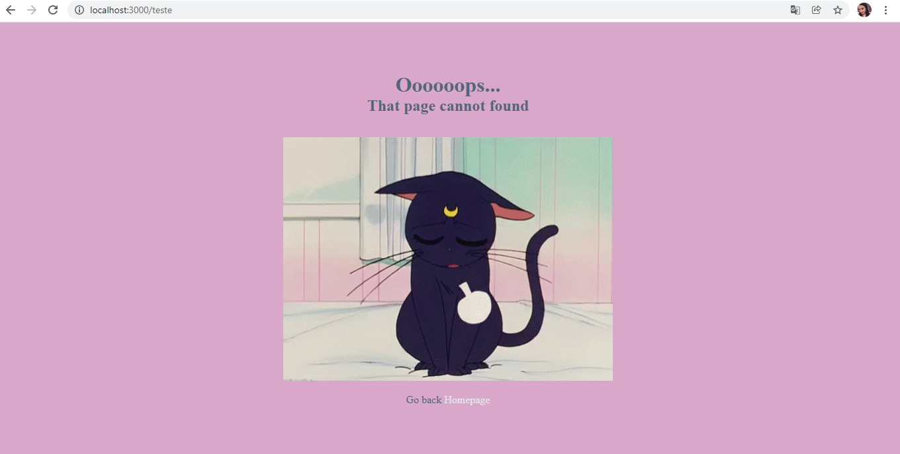

# Discord-Moon

## 💻 Project

Projeto desenvolvido na semana de imersão ReactJs/NextJs da Alura, inspirado no anime Sailor Moon 🌙

## :rocket: Technologies

Este projeto foi desenvolvido utilizando as seguintes tecnologias:

- [React](https://reactjs.org)
- [Next](https://nextjs.org)
- [Supabase](https://supabase.com/)
- [DayJs](https://day.js.org/)

### Screens

  
  
  
  
  

